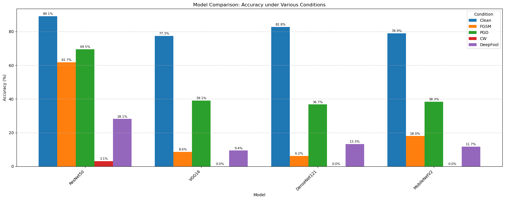
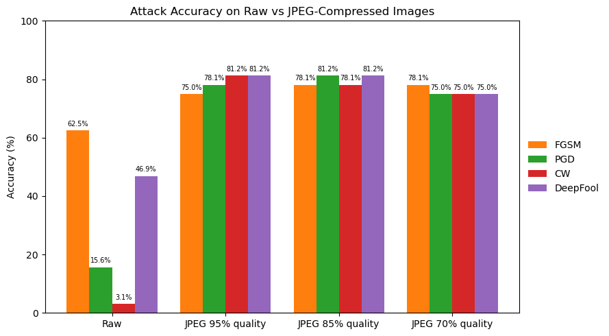
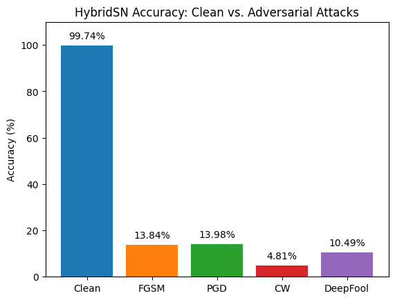

# Cross-Domain Adversarial Robustness Analysis: CNNs and Hyperspectral Networks

This repository presents a comprehensive evaluation for assessing the adversarial robustness of deep neural networks across different domains. The study conducts systematic experiments on standard Convolutional Neural Networks (CNNs) using natural imagery and specialized hyperspectral classification models (HybridSN), providing insights into vulnerability patterns and defense mechanisms across diverse image modalities.

## Project Overview

This research framework implements and evaluates multiple state-of-the-art adversarial attack methodologies across two distinct domains:

### **Attack Implementations**
- **FGSM (Fast Gradient Sign Method):** Single-step gradient-based attack for efficient adversarial example generation
- **PGD (Projected Gradient Descent):** Multi-step iterative attack with projection constraints for stronger perturbations
- **C&W (Carlini & Wagner):** Optimization-based attack minimizing perturbation magnitude while maintaining misclassification
- **DeepFool:** Geometric approach finding minimal perturbations to decision boundaries

### **Evaluation Domains**
- **Standard Computer Vision:** Robustness assessment of CNN architectures (ResNet, DenseNet, VGG) on ImageNet validation subset
- **Hyperspectral Remote Sensing:** Vulnerability analysis of HybridSN model for hyperspectral image classification using Indian Pines dataset

### **Analysis Components**
- **Model Comparison (`model_comparison.ipynb`):** Comparative robustness evaluation across different CNN architectures
- **Parameter Impact Analysis (`parameter_impact.ipynb`):** Systematic study of attack parameter sensitivity and effectiveness
- **JPEG Compression Effects (`jpeg_impact.ipynb`):** Investigation of compression-based defense mechanisms and their impact on adversarial robustness
- **Hyperspectral Analysis (`hyperspectral.ipynb`):** Domain-specific evaluation of adversarial attacks on hyperspectral classification models

## Environment Setup

This repository provides two environment YAML files for easy setup with Conda:

- **For CNN experiments (`model_comparison.ipynb`, `parameter_impact.ipynb`, `jpeg_impact.ipynb`):**
  ```sh
  conda env create -f env_cnns.yml
  conda activate CNNs
  ```
- **For hyperspectral experiments (`hyperspectral.ipynb`):**
  ```sh
  conda env create -f env_hybridsn.yml
  conda activate HybridSN
  ```

**Note:**
The provided environments install PyTorch **without CUDA support** by default. If you have a compatible GPU and want to enable CUDA acceleration, you must reinstall PyTorch with CUDA. See [PyTorch installation instructions](https://pytorch.org/get-started/locally/) and select the appropriate CUDA version for your system.

## Results

The following plots showcase key findings from our adversarial robustness analysis across different domains and models:

### Model Comparison: CNN Architecture Robustness


This analysis compares the accuracy of different CNN architectures (ResNet50, VGG16, DenseNet121, MobileNetV2) under various adversarial attacks. 

**Key finding:** ResNet50 demonstrates significantly higher resistance to adversarial attacks compared to other architectures, maintaining better accuracy across all attack types (FGSM, PGD, C&W, DeepFool).

### JPEG Compression Impact on Adversarial Attacks


This study investigates how JPEG compression affects the effectiveness of adversarial attacks. 

**Key finding:** Saving images to JPEG format effectively destroys adversarial perturbations, regardless of the attack type used. This compression-based defense mechanism significantly reduces attack success rates across all tested adversarial methods.

### HybridSN Vulnerability Analysis


This evaluation assesses the robustness of the HybridSN model on hyperspectral data (Indian Pines dataset) against various adversarial attacks. 

**Key finding:** The HybridSN model shows high vulnerability to all tested adversarial attacks, with substantial accuracy drops across different attack methods, indicating that hyperspectral classification models may require additional defensive measures.


## Attribution

This repository makes use of the following datasets and external resources:
- [Indian Pines dataset](https://www.ehu.eus/ccwintco/index.php?title=Hyperspectral_Remote_Sensing_Scenes#Indian_Pines) on CC0 1.0 Universal License
- [Subset of ImageNet validation set](https://www.kaggle.com/datasets/titericz/imagenet1k-val) on CC0 1.0 Universal License 
- [HybridSN implementation and pretrained weights](https://github.com/Pancakerr/HybridSN) on MIT License

